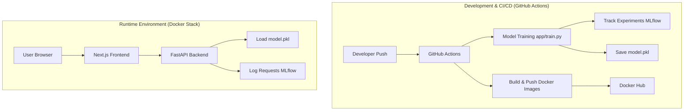

# 🎬 Movie Recommendation System

A production-ready MLOps pipeline for a movie recommendation engine. This project combines a **FastAPI** backend, a **Next.js** frontend, and advanced MLOps tools like **MLflow** and **GitHub Actions**.

---

## 🚀 How the Project Works (Workflow)

This project follows a professional **CI/CD/MLOps** lifecycle:

1.  **Data Ingestion:** The system uses `data/movies.csv` to learn about movie genres and descriptions.
2.  **Automated Training:** Every time code is pushed, **GitHub Actions** triggers a training job (`app/train.py`).
3.  **Experiment Tracking (MLflow):** During training, MLflow logs parameters (like movie count) and saves the trained model as a "versioned artifact."
4.  **Quality Assurance:** Automated tests (`pytest`) and linting (`flake8`) ensure the code is bug-free before deployment.
5.  **Containerization:** The app is packaged into **Docker** images for both the frontend and backend.
6.  **Deployment:** Services are orchestrated using **Docker Compose**, making it easy to run the entire stack (Frontend, Backend, MLflow) with a single command.

---

## 🏗️ Architecture Flow



---

## 📂 Project Structure

- `app/`: **FastAPI Backend** - Handles recommendation logic and serves the API.
- `frontend/`: **Next.js Frontend** - The user interface where you search for movies.
- `data/`: **Dataset** - Contains the movie information used for training (versioned with DVC).
- `models/`: **Model Storage** - Local storage for the generated recommendation model.
- `.github/workflows/`: **CI/CD Pipeline** - The automation scripts for building and testing.

---

## 🛠️ Getting Started

### 1. Local Setup with Docker Compose (Recommended)
The easiest way to run the project is using **Docker Compose**:

1.  **Run the entire stack:**
    ```bash
    docker-compose up --build
    ```
2.  **Explore the services:**
    - 🌐 **Frontend UI:** [http://localhost:3000](http://localhost:3000)
    - ⚙️ **Backend API:** [http://localhost:8000](http://localhost:8000)
    - 📊 **MLflow Dashboard:** [http://localhost:5000](http://localhost:5000)

### 2. Manual Setup (Development)

#### Backend
1. Create a virtual environment: `python -m venv venv`
2. Activate it: `venv\Scripts\activate` (Windows) or `source venv/bin/activate` (Linux/Mac)
3. Install dependencies: `pip install -r requirements.txt`
4. Run the backend: `python -m app.main`

#### Frontend
1. Navigate to the frontend directory: `cd frontend`
2. Install dependencies: `npm install`
3. Run the development server: `npm run dev`

### 3. Data Versioning (DVC)
Data is managed using DVC. To pull the latest data:
```bash
dvc pull
```

---

## 🧠 MLOps Features

- **MLflow Tracking:** Monitors training runs and manages model versions systematically.
- **Multi-Stage Docker Builds:** Optimized images that are small, secure, and fast to build.
- **GitHub Actions CI/CD:** Fully automated pipeline from "Code Push" to "Docker Image."
- **TF-IDF Recommender:** A content-based filtering system that suggests movies based on genre and plot similarity.

---

## 📜 License
This project is licensed under the MIT License.
